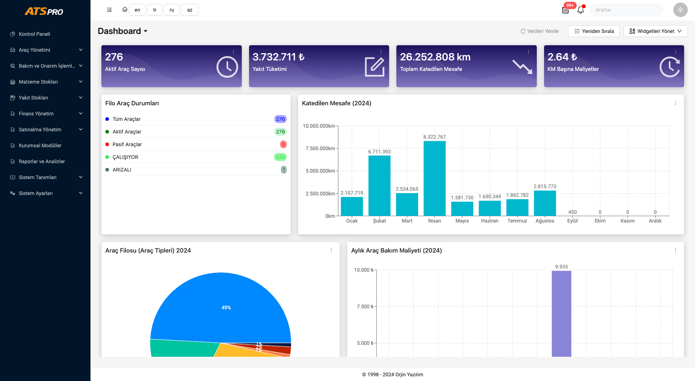
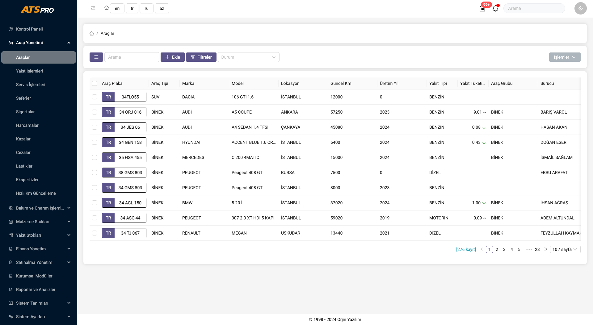
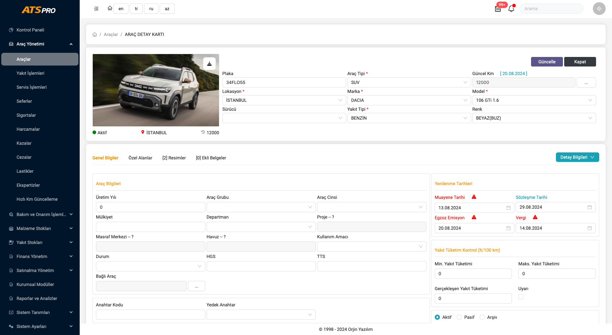
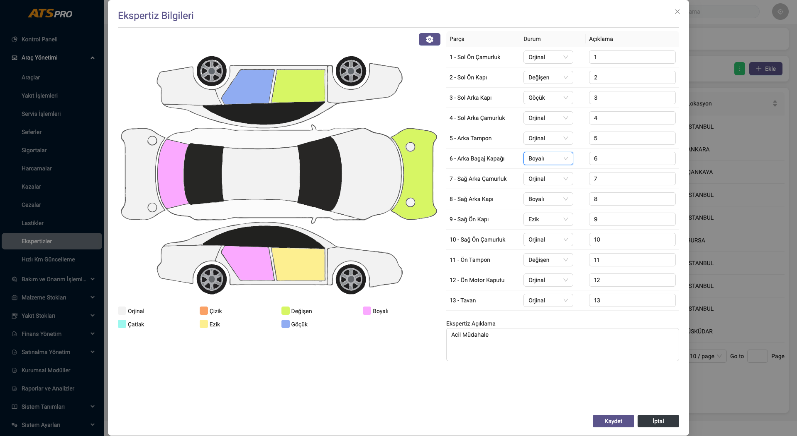

# ATS Pro - Fleet Management Application

## Overview

ATS Pro is a fleet management application developed using React for the frontend and a RESTful API for backend communication. The user interface (UI) is built using Ant Design, providing a clean and modern look.

## Features

- **Fleet Management**: Manage vehicles, drivers, and maintenance schedules efficiently.
- **Real-Time Tracking**: Track your fleet's location and status in real-time.
- **Reports & Analytics**: Generate detailed reports on fleet performance and maintenance costs.
- **User Management**: Role-based access control for different levels of users.
## Screenshots

Here are some screenshots of the application:

### Dashboard



### Fleet Management




### Expert Reports



## Installation

1. Clone the repository:
    ```bash
    git clone https://github.com/yourusername/ats-pro.git
    cd ats-pro
    ```

2. Install the dependencies:
    ```bash
    npm install
    ```

3. Start the development server:
    ```bash
    npm start
    ```


## Technologies Used

- **React**: Frontend library for building user interfaces.
- **Ant Design**: UI framework for a clean and professional look.
- **RESTful API**: For backend communication.

## Contributing

Contributions are welcome! Please fork the repository and submit a pull request.

## License

This project is licensed under the MIT License - see the [LICENSE](LICENSE) file for details.

## Contact

If you have any questions or suggestions, feel free to contact me at [your.email@example.com](mailto:your.email@example.com).
